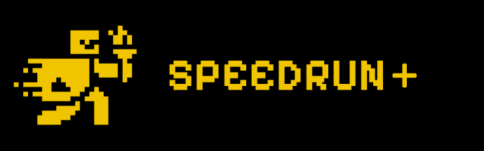

# About

## Licensing and Contributions

This project is licensed under the [MIT License](LICENSE.md), allowing open use, modification, and distribution.

Contributions are welcome! However, all contributions must follow the rules
outlined in [CONTRIBUTING](CONTRIBUTING.md) and are subject to the [Contributor License Agreement](CLA.md).
Only contributions approved by the project owner will be merged into the official version.